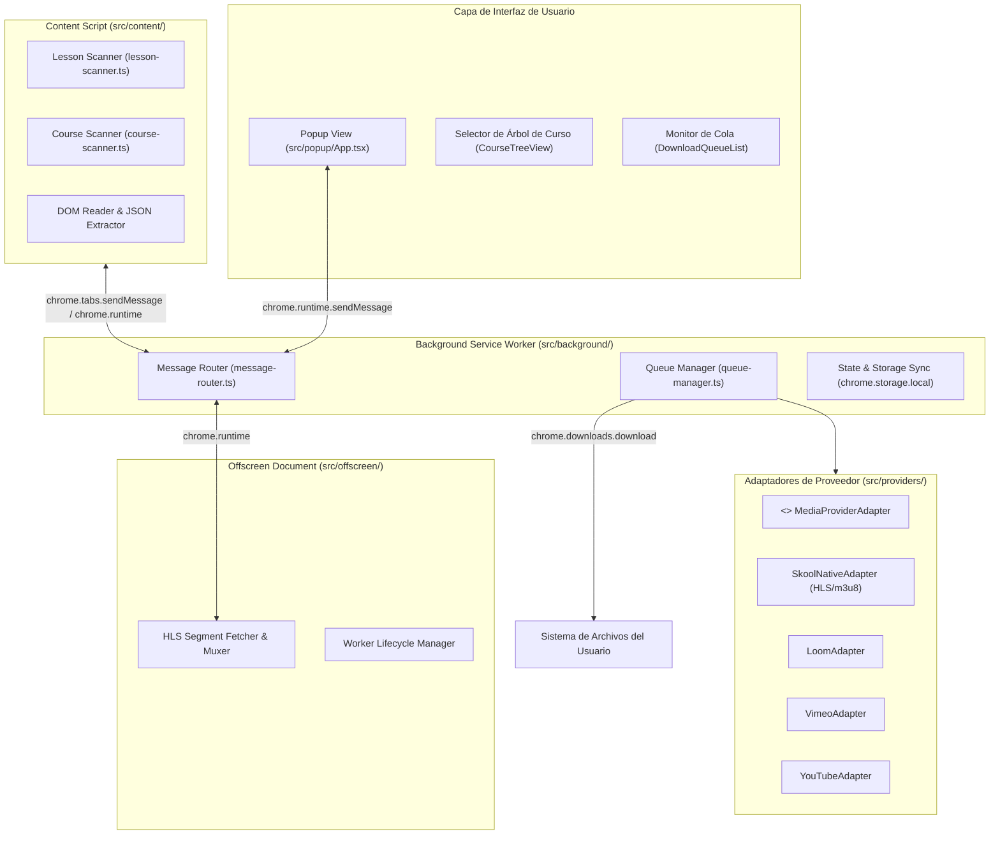

# 02 - Technical Architecture Specification (Architecture Spec)

## 1. Topología del Sistema (Manifest V3)



---

## 2. Responsabilidades de Cada Componente

### 2.1. Content Script (`src/content/`)
- Se inyecta en `https://www.skool.com/*`.
- **Modo No Invasivo**: Solo se activa para leer datos ante un mensaje explícito o evento de navegación en la pestaña activa.
- **`LessonScanner`**:
  - Lee el contenedor de la lección activa (`[data-testid="lesson-content"]`, títulos, descripción).
  - Extrae los adjuntos (etiquetas `<a>` con descargas directas de S3/CloudFront/Skool).
  - Detecta el reproductor incrustado: busca etiquetas `<video>` nativas, `<iframe>` de Loom/Vimeo/YouTube/Wistia o estados serializados en el DOM.
- **`CourseScanner`**:
  - Obtiene el listado de módulos y lecciones a partir de la barra lateral de navegación del aula virtual (`Classroom`).

### 2.2. Background Service Worker (`src/background/`)
- Mantiene el estado global de la cola (`QueueManager`).
- Controla la concurrencia (`maxConcurrentDownloads: 2`).
- Asigna la ruta final y nombre de archivo sanitizado a cada elemento descargado.
- Orquesta la creación y cierre bajo demanda del documento offscreen cuando hay descargas de streaming pendientes.

### 2.3. Offscreen Document (`src/offscreen/`)
- Chrome MV3 suspende el Service Worker tras unos segundos de inactividad de la API. Las descargas de video HLS requieren mantener conexiones de streaming activas y realizar operaciones de conversión de chunks multimedia sin suspenderse.
- El documento `offscreen.html` se crea dinámicamente con `chrome.offscreen.createDocument` solo durante la descarga de streams HLS/DASH y se destruye al finalizar.

### 2.4. Adaptadores de Video (Strategy Pattern)
- Todos los proveedores implementan el contrato `MediaProviderAdapter`:
  ```typescript
  export interface MediaProviderAdapter {
    readonly providerName: string;
    canHandle(sourceUrl: string, elementMeta?: Record<string, unknown>): boolean;
    extractQualities(sourceUrl: string, elementMeta?: Record<string, unknown>): Promise<VideoQualityOption[]>;
    resolveDownloadStream(qualityUrl: string, options: DownloadOptions): Promise<DownloadStreamResult>;
  }
  ```
