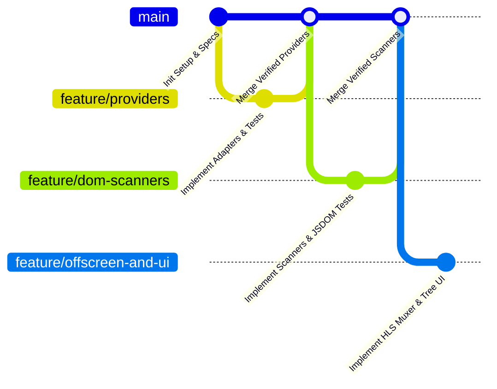

# 05 - SDD Workflow and Branching Strategy Specification

## 1. Principio de Ramificación por Especificación (Spec-to-Branch Mapping)

En la metodología **Spec-Driven Development (SDD)**, el desarrollo de funcionalidades sigue un ciclo estricto de aislamiento, prueba y merge:

---

## 2. Reglas del Flujo de Trabajo

1. **Rama Base (`main`)**:
   - `main` siempre permanece en un estado compilable (`npm run build` sin errores) y con el 100% de las pruebas unitarias pasando (`npm test`).
   - Todo commit en `main` debe ser resultado de un merge de una rama `feature/*` verificada.

2. **Ramas de Funcionalidad (`feature/<hito-especificacion>`)**:
   - Cada rama aborda un único hito o contrato técnico especificado en `docs/specs/`.
   - Convención de nombres:
     - `feature/provider-adapters` (Hito de adaptadores de video)
     - `feature/dom-scanners` (Hito de escáneres DOM)
     - `feature/offscreen-engine` (Hito de procesamiento multimedia HLS)
     - `feature/popup-course-tree` (Hito de interfaz de usuario)
     - `fix/<descripcion>` (Corrección de bugs o ajustes de schema)

3. **Criterios de Merge hacia `main` (Definition of Done)**:
   - ✅ Código tipado estrictamente (sin `any` injustificados, pasando `tsc --noEmit`).
   - ✅ Pruebas unitarias de la especificación escritas y pasando al 100% con `vitest`.
   - ✅ Compilación de producción (`npm run build`) limpia sin advertencias de Manifest V3.
   - ✅ Push hacia el repositorio remoto `origin/main`.
